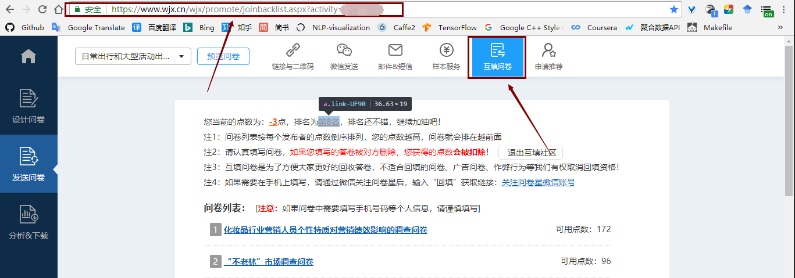
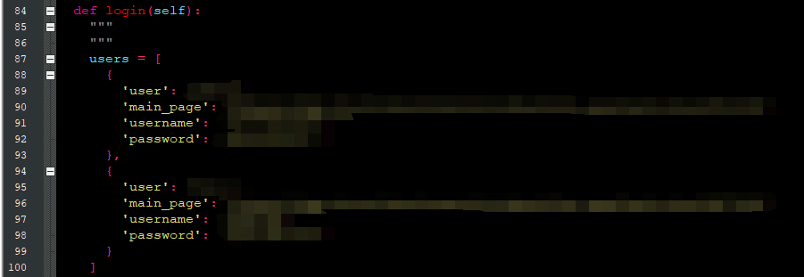

# survey-auto-writer-in-python
---
title: 问卷星自动填写问卷脚本
tags: survey, auto-writer, 问卷星
time: 2018/07/06
---
作者的开发运行环境与依赖：
  Window10_x64, Python3.6, selenium
  
运行脚本前需要指定问卷网站地址，即下图所示的地址

然后修改代码中的账号密码， 如下所示，填入其中的
'user': 随意写
'main_page': 上面的地址
'username': 账号
'password': 密码

然后执行即可，刚做没多久还有些bug，比如登陆时需要验证码这一块还没有集成进去也懒得弄了，就这样吧，一般过个十几秒就不需要验证码了，关系应该不大，希望能帮到有缘人。